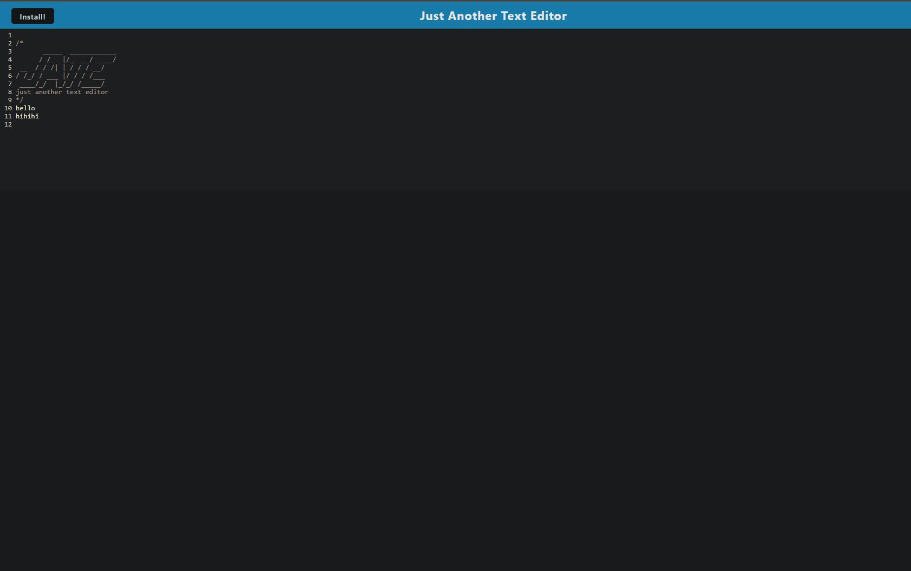

# theTextEditor

## Description
This is an application demonstrating how to create and use a text editor with persistent text whether online or not by using webpack,idb, and service workers. 

## Installation
Install node.js and then npm install all the requisite packages if using on VScode, if using via deployed link, click the install button on the upper left.

## Technologies
Javascript
nodeJS
npm:
babel
webpack
idb
css loader
style loader
workbox
http-server
concurrently

## Usage
When the user loads the application, it appears to be just a text editor.  Text can be entered followed by the enter key whether they are online or not, by installing the application with a click.  The users text should persist in the editor. To run in VScode open a terminal and enter npm run start.

## license
See repository for licensing information 

## Credits
Collaborators include: Alic Madd, Drew Hoang, and Kyle Vance
resources used: MDN, W3 schools, google search

## links

github repo:
https://github.com/RTAKA808/theTextEditor

screenshot:

demo link:
https://thetexteditor-q55t.onrender.com/